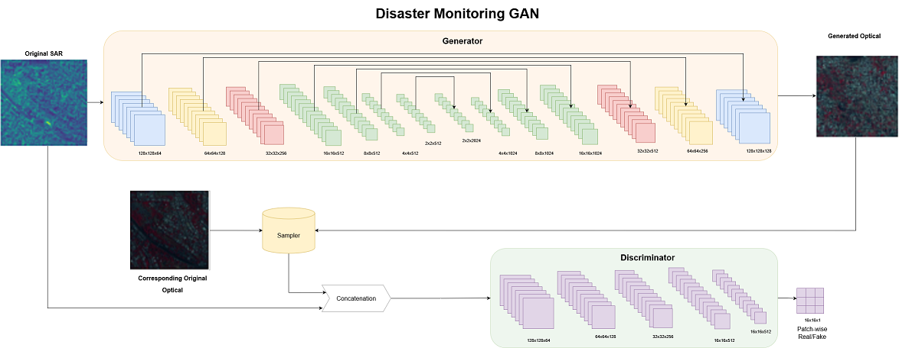
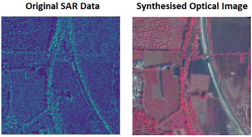

# DisMonGAN-SAR2Optical-Translation-for-Disaster-Monitoring

Cyclones and floods are significant disasters seen by south-east Asian countries. With cloud occlusions on the affected regions, monitoring the disaster becomes tedious. Synthetic Aperture Radars (SAR) can penetrate through the clouds (due to their microwave frequencies) and image the area underneath. Being active sensors, they also can image around the clock. These properties enable the domain experts to use SAR images for disaster monitoring; however, even professionals find it challenging to interpret the data since the human eye is unfamiliar with the impact of distance-dependent imaging, signal intensities observed in the radar spectrum, and image features associated to speckle or post-processing procedures. This work exploits the valuable imaging properties of SAR images to propose a Generative Adversarial Network (GAN) to synthesize realistic and semantic optical images by conditioning them over the microwave satellite images. It enables the model to synthesize optical images of an affected area in all weather and around the clock conditions, making it a critical disaster monitoring assistance tool.

The architecture used in the work is shown below and the code can be found in `train_dismongan.py`

A sample generation of optical image by the proposed model is give below, blur and radiometry saturations are still observed in the generated data

